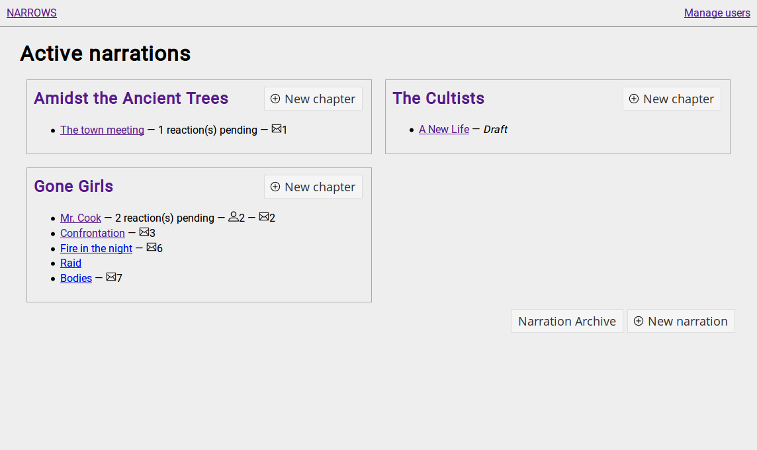
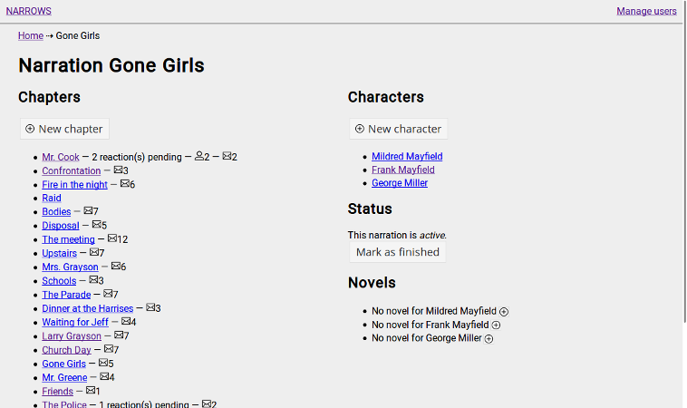
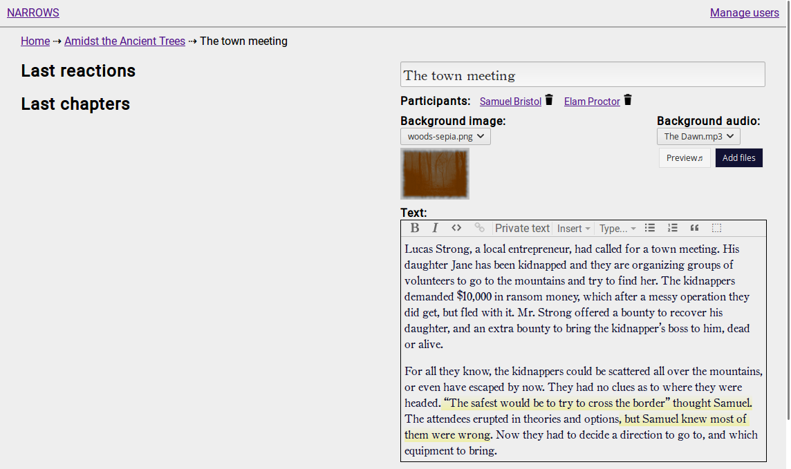
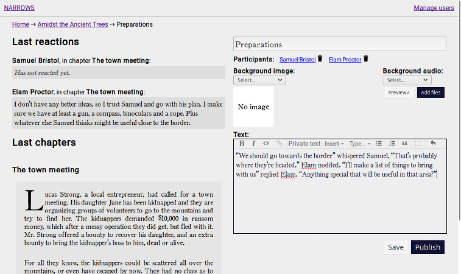
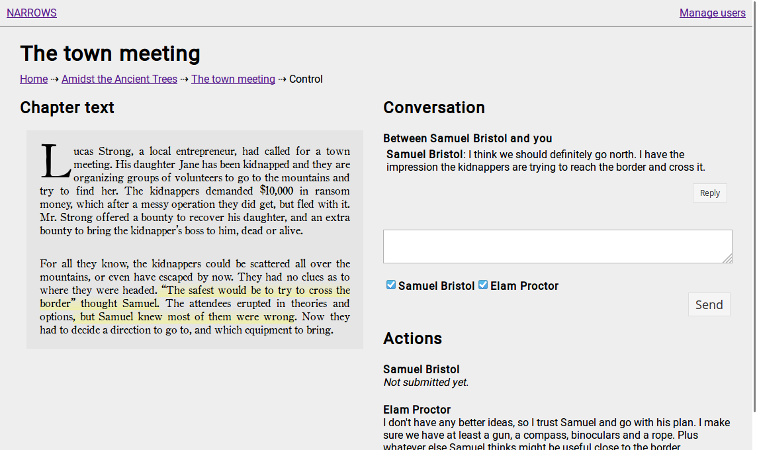
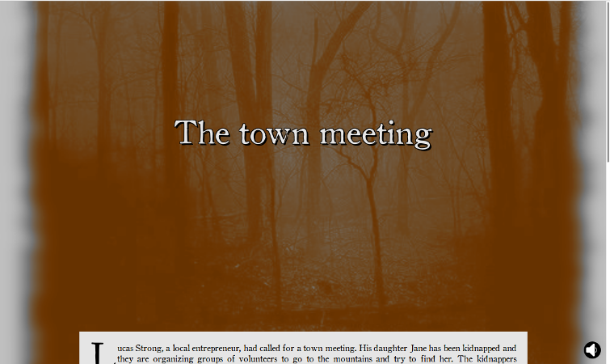

# NARROWS

NARROWS is an online storytelling system. The name stands for
NARRation On Web System. The easiest way to explain it is to
imagine an online [gamebook](https://en.wikipedia.org/wiki/Gamebook)
with the following differences:

1. Instead of having a single reader, there are as many readers as
   protagonists in the story (it could be one, but also four or five).
1. Instead of having to choose between two or three preset choices
   after each "chapter", readers can _write_ in a textbox whatever
   their characters do.
1. Instead of the narrator writing the whole story with all possible
   branches upfront, then give it to the readers; the narrator writes
   only one chapter at a time and waits for the readers to submit the
   "actions" for their characters. Based on those actions, the
   narrator writes the next chapter.

You can also think of it as a way of running ruleless, diceless RPGs
online (which is indeed the reason why I wrote it in the first
place).

# Installation

NARROWS is a web application with a backend. As such, it needs a
server connected to the internet to be used. For installation
instructions, please have a look at the `README.md` file in the [GitHub
repo](https://github.com/emanchado/narrows/blob/master/README.md#installation).

# How does it work?

A specific telling of a story to a specific group of people is called
a _narration_ in NARROWS. A narration has a group of protagonists
called _characters_ (Player Characters in regular RPG parlance) which
are played by one user each. A narration contains _chapters_, which is
a body of text with a background image and a soundtrack. Each player
submits a character _action_ for every chapter. Once every player has
replied, the narrator can read all actions and write the next chapter.

To avoid players having to create accounts, when a chapter is
published a special URL is built for every character, and sent via
e-mail to the appropriate player. Thus, players simply wait for an
e-mail for every chapter, then click a link and they are ready to
read.

# How does it look?

This is the narrator's dashboard:

---------------------

This is a narration's overview page:

---------------------

This is a chapter's creation/edit page (first chapter of the
narration, so no previous chapter to refer to):

---------------------

This is a chapter's creation/edit page showing the previous chapter's
reactions and text:

---------------------

This is a (published) chapter's control panel:

---------------------

This is how a chapter looks for a player:

---------------------

This is how a chapter looks for a player when you scroll past the
chapter text itself to see the messages and action box:

# Credits

* Speaker/mute icons made by
  [Madebyoliver](http://www.flaticon.com/authors/madebyoliver), from
  [Flaticon](http://www.flaticon.com). They are licensed under
  Creative Commons BY 3.0.
* Trash icon by [Freepik](http://www.flaticon.com/authors/freepik),
  from [Flaticon](http://www.flaticon.com). Licensed under Creative
  Commons BY 3.0.
* Add/plus icon, message icon and user icon by
  [Lucy G](http://www.flaticon.com/authors/lucy-g), from
  [Flaticon](http://www.flaticon.com). Licensed under Creative Commons
  BY 3.0.
* RSS icon by [Dave Gandy](http://www.flaticon.com/authors/dave-gandy)
  from [Flaticon](http://www.flaticon.com). Licensed under Creative
  Commons BY 3.0.
* Vintage divider by
  [Web Design Hot](http://www.webdesignhot.com/free-vector-%20graphics/vector-set-of-vintage-design-divider-elements/). Licensed
  under Creative Commons BY 3.0.
